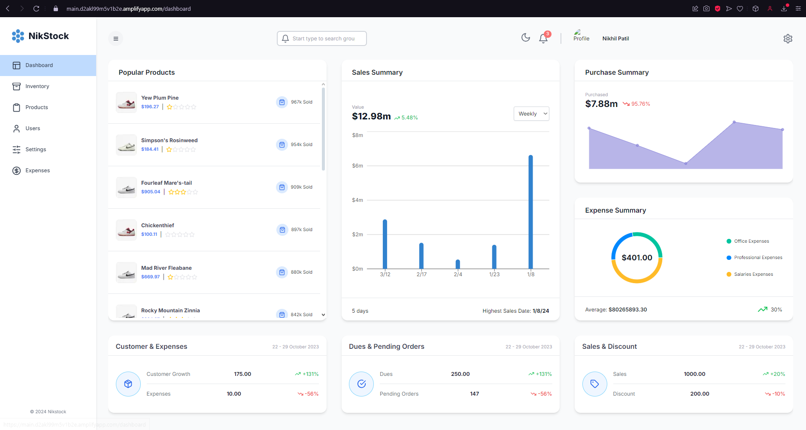
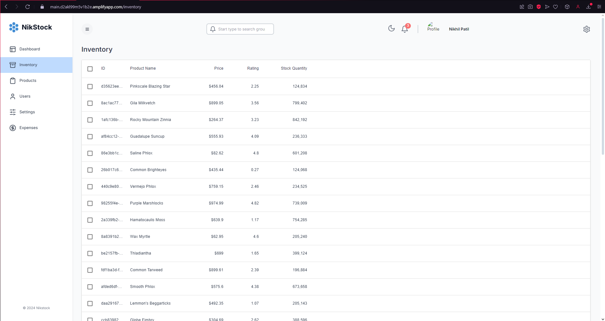
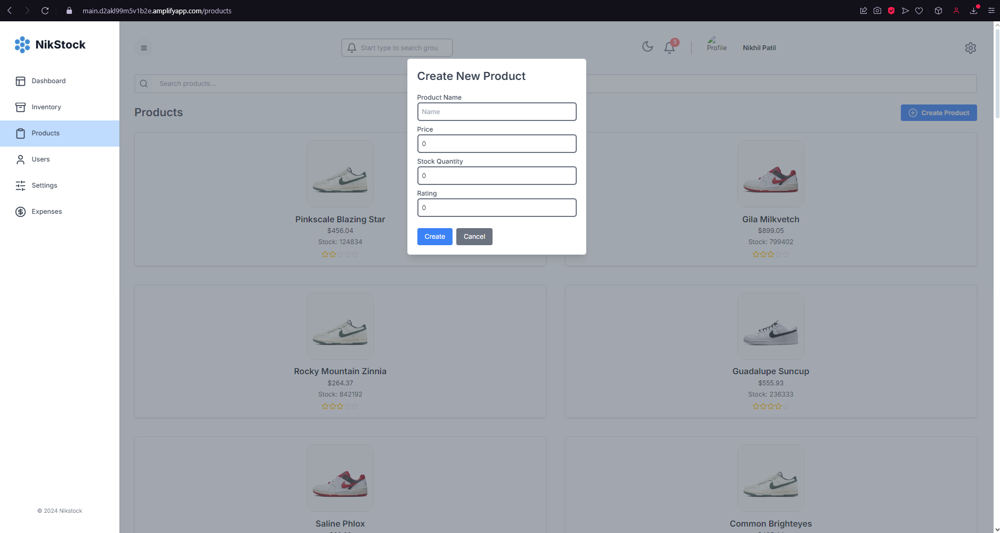
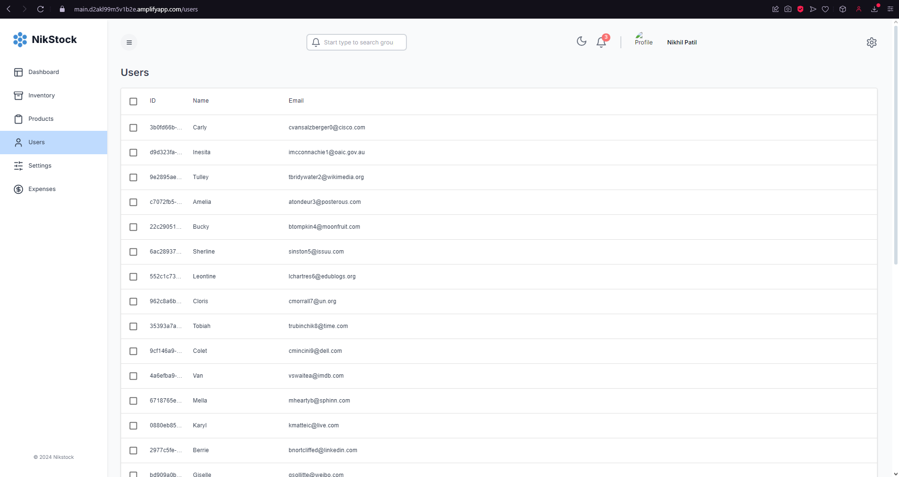
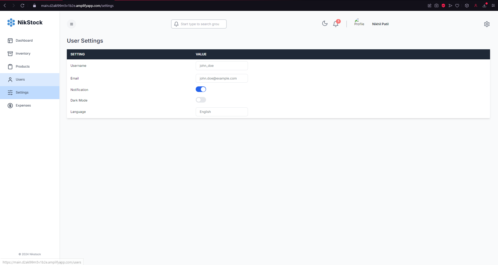
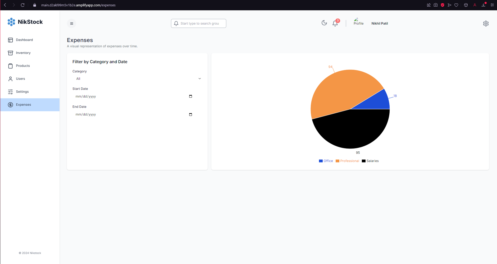

# Inventory Management Dashboard

This project involves building and deploying a full-stack Inventory Management Dashboard Application using modern web technologies. The application is developed with Next.js for the frontend, incorporating Redux Toolkit for state management and Tailwind CSS for styling. The backend is powered by Node.js with Prisma ORM for seamless database interactions. The entire application is deployed on AWS, utilizing services such as RDS, EC2, API Gateway, Amplify, and S3 to ensure scalability and reliability.

## Table of Contents

- [Project Overview](#project-overview)
- [Demo](#demo)
- [Tech Stack](#tech-stack)
- [Frontend](#frontend)
- [Backend](#backend)
- [AWS Services](#aws-services)
- [Prerequisites](#prerequisites)
- [Setup and Installation](#setup-and-installation)
- [Deployment](#deployment)
- [Links and Resources](#links-and-resources)

## Project Overview

This project is a full-stack inventory management dashboard that provides the following features:

- **Complex Data Handling**: Utilizing Material UI Data Grid for managing and displaying data.
- **State Management**: Implemented using Redux Toolkit and Redux Toolkit Query for efficient state and data fetching management.
- **Scalable Backend**: Powered by Node.js and Prisma ORM, ensuring smooth database interactions.
- **AWS Integration**: Deployed on AWS using a variety of services to ensure scalability, reliability, and cost-efficiency.

## Demo

This project includes the following pages and features:

### Available Pages:
- **Dashboard**: Overview of inventory status and key metrics.
- **Inventory**: Detailed management of inventory items.
- **Products**: Manage and add new products.
- **Users**: User management interface.
- **Settings**: Application settings and configurations.
- **Expenses**: Track and manage expenses.

### Dark/Light Mode:
- The application supports both dark and light modes for better user experience.

### Previews:

#### Dashboard


#### Inventory


#### Products


#### Users


#### Settings


#### Expenses


#### Dark Mode


## Tech Stack

### Frontend
- **Next.js**: React framework for building server-side rendered applications.
- **Redux Toolkit**: State management tool integrated with Next.js for seamless data flow.
- **Tailwind CSS**: Utility-first CSS framework for rapid UI development.
- **Material UI**: Provides Data Grid component for complex data display.

### Backend
- **Node.js**: JavaScript runtime for building scalable server-side applications.
- **Prisma ORM**: An open-source ORM for PostgreSQL, enabling type-safe database queries.

### AWS Services
- **RDS (Relational Database Service)**: Managed relational database service for PostgreSQL.
- **EC2 (Elastic Compute Cloud)**: Scalable virtual servers for running the application.
- **API Gateway**: Managed service for creating, deploying, and managing APIs.
- **Amplify**: Hosting service for front-end web applications.
- **S3 (Simple Storage Service)**: Scalable object storage for images, files, and more.

## Prerequisites

Before starting the setup, ensure you have the following installed:

- [Node.js](https://nodejs.org/en)
- [Visual Studio Code](https://code.visualstudio.com/)
- [PostgreSQL](https://www.postgresql.org/download/)
- [PgAdmin](https://www.pgadmin.org/download/)
- [Prisma CLI](https://www.prisma.io/docs/getting-started)
- [Postman](https://www.postman.com/downloads/)

For AWS setup:

- [AWS CLI](https://docs.aws.amazon.com/cli/latest/userguide/cli-configure-quickstart.html)
- AWS Account

## Setup and Installation

### 1. Clone the Repository

```bash
git clone https://github.com/ed-roh/inventory-management-dashboard.git
cd inventory-management-dashboard
```

### 2. Install Dependencies

For the frontend:

```bash
cd frontend
npm install
```

For the backend:

```bash
cd backend
npm install
```

### 3. Setup PostgreSQL and Prisma

- Install PostgreSQL and set up a new database.
- Configure Prisma to connect to your database.

```bash
npx prisma generate
npx prisma migrate dev
```

### 4. Start the Development Servers

Frontend:

```bash
npm run dev
```

Backend:

```bash
npm start
```

### 5. AWS Configuration

- Setup and configure AWS CLI.
- Deploy the backend on **EC2** and **RDS**.
- Use **Amplify** for deploying the frontend.
- Utilize **API Gateway** for managing APIs.
- Store static assets in **S3**.

Refer to the [AWS commands](https://github.com/ed-roh/inventory-management-dashboard/aws-commands.md) for detailed deployment steps.

## Deployment

### Deploying Backend to AWS

1. Create an EC2 instance and configure it with the necessary environment (Node.js, Prisma).
2. Set up an RDS instance for PostgreSQL.
3. Deploy the Node.js application to EC2 and connect it to RDS.

### Deploying Frontend to AWS Amplify

1. Push your frontend code to a repository like GitHub.
2. Connect your repository to AWS Amplify.
3. Configure build settings and deploy the application.

### Using S3 for Storage

1. Create an S3 bucket.
2. Upload necessary static assets like images, config files, etc.
3. Update your application to use S3 for asset retrieval.

## Links and Resources

### Backend
- [Node.js](https://nodejs.org/en)
- [VSCode](https://code.visualstudio.com/)
- [PostgreSQL](https://www.postgresql.org/download/)
- [PgAdmin](https://www.pgadmin.org/download/)
- [Prisma Documentation](https://www.prisma.io/docs/getting-started)
- [Postman](https://www.postman.com/downloads/)

### AWS
- [AWS Console](https://aws.amazon.com/)
- [AWS CLI](https://docs.aws.amazon.com/cli/latest/userguide/cli-configure-quickstart.html)
- [AWS Billing Dashboard](https://us-east-1.console.aws.amazon.com/billing)
- [AWS Free Tier](https://aws.amazon.com/free/?all-free-tier)
- [AWS IPv4 New Charge](https://aws.amazon.com/blogs/aws/new-ipv4-pricing/)
- [AWS IPv4 Free Tier](https://aws.amazon.com/about-aws/whats-new/2023/07/aws-global-ipv4-address-free-tier/)

### Frontend
- [Next.js Documentation](https://nextjs.org/docs/getting-started)
- [Redux Toolkit with Next.js](https://redux-toolkit.js.org/usage/nextjs)
- [Redux Toolkit Query](https://redux-toolkit.js.org/rtk-query/overview)
- [Tailwind CSS](https://tailwindcss.com/docs/installation)
- [Recharts](https://recharts.org/en-US/api)
- [Material UI Data Grid](https://mui.com/x/react-data-grid/)

### Code Samples
- [Completed Code](https://github.com/ed-roh/inventory-management-dashboard)
- [Tailwind Config](https://github.com/ed-roh/inventory-management-dashboard/blob/main/tailwind.config.ts)
- [Redux Store File](https://github.com/ed-roh/inventory-management-dashboard/blob/main/src/app/store.ts)
- [Seed Files](https://github.com/ed-roh/inventory-management-dashboard/blob/main/prisma/seed.ts)
- [Seed Data Files](https://github.com/ed-roh/inventory-management-dashboard/blob/main/prisma/seed-data.ts)
- [Data Model Diagram](https://drawsql.app/teams/team-3023/diagrams/inventory-management)
- [Prisma Schema File](https://github.com/ed-roh/inventory-management-dashboard/blob/main/prisma/schema.prisma)
- [AWS Commands](https://github.com/ed-roh/inventory-management-dashboard/blob/main/aws-commands.md)
